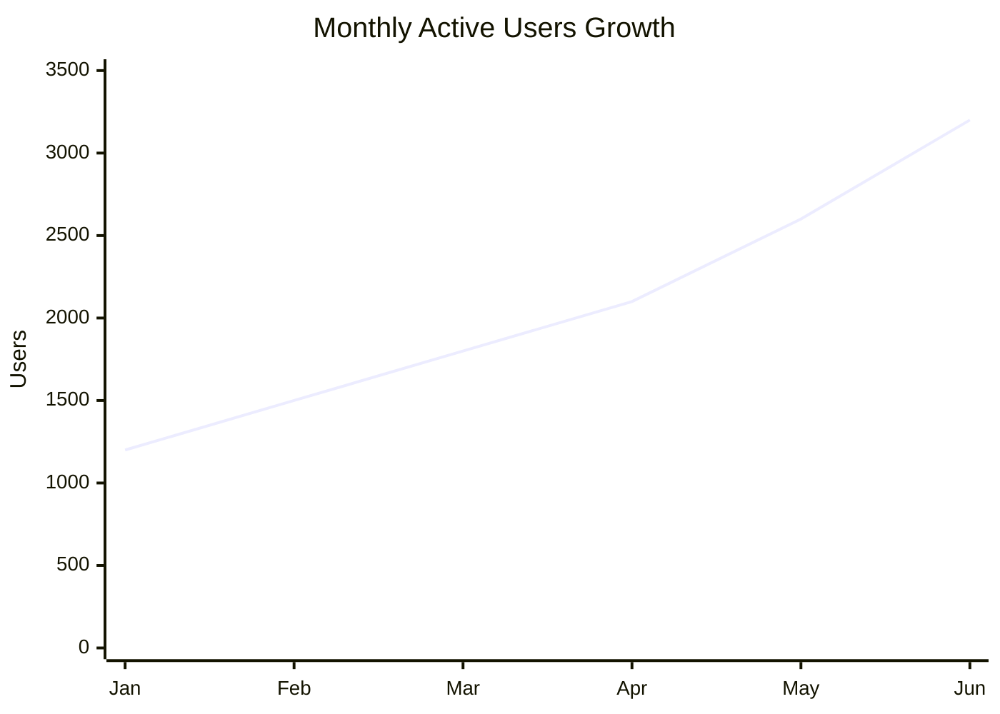
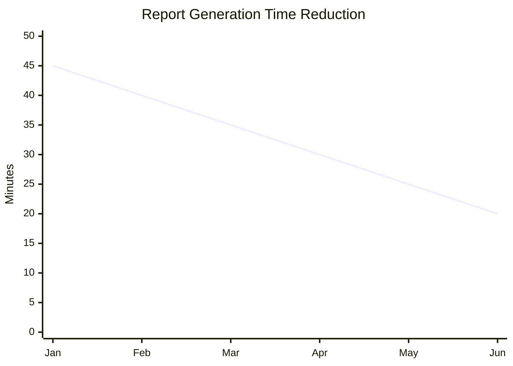
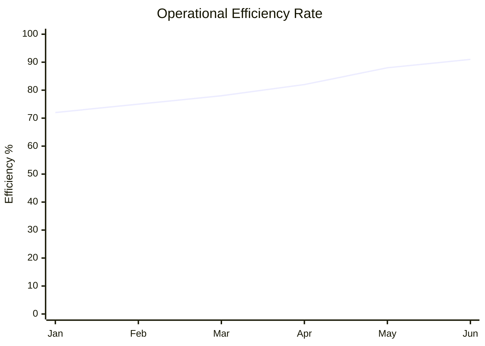

# 🚀 AI-Powered Operations Analytics Platform  
### Technical Product Management Case Study

## 📌 Overview
This repository simulates the end-to-end development of a data-driven internal analytics product designed to improve operational efficiency and executive decision-making.

## 🎯 Problem
Operations teams rely on fragmented reporting systems, manual Excel workflows, and delayed KPI visibility. This leads to slow decision-making, inconsistent metrics, and operational inefficiencies.

## 💡 Proposed Solution
A centralized analytics platform that:
- Tracks KPIs in real-time
- Automates reporting workflows
- Provides predictive risk alerts
- Enables data-driven product and operational decisions

## 📈 Business Impact Goals
- Reduce manual reporting effort by 40%
- Improve dashboard performance by 30%
- Increase operational visibility across teams
- Improve decision turnaround time

## 🛠 My Role
Acted as Product Manager:
- Defined product vision and MVP
- Created PRD and roadmap
- Defined KPI framework
- Prioritized features using RICE
- Designed experimentation strategy
- Outlined technical architecture
## 📊 Active Users Growth

---
